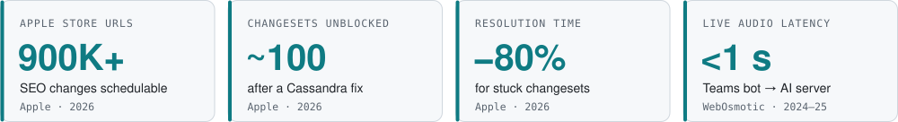

<h1 align="center">Umer Karachiwala</h1>

<samp>backend · devops · platform engineering · dublin, ireland</samp>

<samp>
<a href="https://www.umer-karachiwala.com/">portfolio</a> ·
<a href="https://www.linkedin.com/in/umer-karachiwala/">linkedin</a> ·
<a href="mailto:karachiwalaumer2612@gmail.com">email</a> ·
<a href="https://x.com/UmerKarachiwala">x</a>
</samp>

Backend &amp; DevOps engineer with 2+ years shipping production systems at <b>Apple</b> and early-stage startups: 
distributed services, event-driven pipelines, real-time AI and the cloud infrastructure under them. 
<b>Open to backend, platform, DevOps and SRE roles.</b>

<picture>
  <source media="(prefers-color-scheme: dark)" srcset="assets/impact-dark.svg">
  <source media="(prefers-color-scheme: light)" srcset="assets/impact-light.svg">
  
</picture>

<!-- STATS:START -->
<samp>on github since 2022 · 27 public repos · 247 contributions in the last year · last push 2026-09-22</samp>
<!-- STATS:END -->

### What I'm working on

| Status | Details |
|---|---|
| **Open to** | Backend, platform, DevOps and SRE roles |
| **Building** | [realtime-transcribe](https://github.com/Umer-2612/realtime-transcribe): live speech-to-text with a model that decides when a speaker is done |
| **Researching** | [The carbon cost of CI/CD](https://github.com/Umer-2612/msc-devops-dissertation) across 5 open-source projects (MSc DevOps, ATU) |
| **Previously** | Software Engineer Intern at Apple, Mar – Sep 2026 |

### Experience

**Apple** · Software Engineer Intern · Mar – Sep 2026 · Java, Spring Boot, Cassandra, OpenSearch, SNS/SQS
- Built Scheduled Updates and Revert Changeset across 5 SEO services: changes planned up to 3 months ahead for **900K+ Apple Store URLs**
- Added checks against conflicting edits, then fixed a Cassandra issue that unblocked **~100 stuck changesets** with **~80%** faster resolution
- Built changeset search on OpenSearch with SNS/SQS replication across data centres, after evaluating it against Apple's managed Solr
- Led a cross-functional team at Apple's GenAI Hackathon, shortlisted for sponsorship

**WebOsmotic** · Jr Backend Engineer · Apr 2024 – Jun 2025 · C#, .NET, Azure, Python
- Built a Microsoft Teams bot, run as an Azure multi-tenant service, that joins scheduled interviews on its own
- Designed a **sub-second** WebSocket pipeline streaming live audio to a Python AI server, with health checks and reconnects
- Built document ingestion and RAG questionnaire automation for narad.io, a third-party risk platform

**WebOsmotic** · Software Engineer Intern · Oct 2023 – Mar 2024 · Node.js, MongoDB
- Built an intranet backend with a live biometric punch-machine feed and UTC-normalised, timezone-aware shift tracking

### Featured systems

| System | What it does | Stack |
|---|---|---|
| [realtime-meeting-intelligence](https://github.com/Umer-2612/realtime-meeting-intelligence) | Zoom and Teams bots capturing live audio and video for a Python analysis server | C++, .NET, Python, AWS EKS |
| [realtime-transcribe](https://github.com/Umer-2612/realtime-transcribe) | Self-hosted WebSocket speech-to-text with model-based turn detection | Python, FunASR, Docker |
| [msc-devops-dissertation](https://github.com/Umer-2612/msc-devops-dissertation) | CI/CD carbon study across HTTPie, got, Retrofit, resty and Gson, with a replication package | Python, GitHub Actions |
| [memory-core](https://github.com/Umer-2612/memory-core) | Memory service with semantic search | FastAPI, PostgreSQL, pgvector |

### Recently pushed

<!-- ACTIVITY:START -->
- `2026-09-22` [Umer_Portfolio](https://github.com/Umer-2612/Umer_Portfolio) · TypeScript
- `2026-09-22` [core-api](https://github.com/Umer-2612/core-api) · TypeScript
- `2026-09-22` [web-frontend](https://github.com/Umer-2612/web-frontend) · TypeScript
- `2026-09-22` [realtime-transcribe](https://github.com/Umer-2612/realtime-transcribe) · Python
- `2026-09-17` [secrets-vault](https://github.com/Umer-2612/secrets-vault) · Shell
<!-- ACTIVITY:END -->

### Stack

| Area | Tools |
|---|---|
| Languages | Java, TypeScript, Python, C#, C++ |
| Backend | Spring Boot, Node.js / Express, FastAPI, .NET |
| Data and search | Cassandra, PostgreSQL, MongoDB, Redis, OpenSearch, Solr |
| Cloud and delivery | AWS (EKS, EC2, SQS/SNS), Azure (AKS, Bot Service), Docker, Kubernetes, Terraform, GitHub Actions, Jenkins |
| Observability | Splunk, Prometheus, CloudWatch, ELK |

MSc Computing (DevOps), ATU, 2025 – 2026 · B.Tech Computer Engineering, 2021 – 2025 · Employee of the Month, WebOsmotic · FusionHack 2024 finalist
