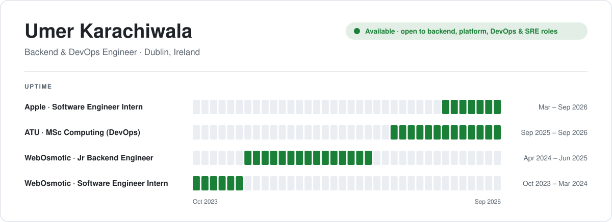
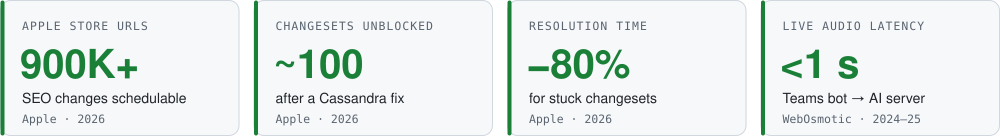

<picture>
  <source media="(prefers-color-scheme: dark)" srcset="assets/header-dark.svg">
  <source media="(prefers-color-scheme: light)" srcset="assets/header-light.svg">
  
</picture>

<samp>
<a href="https://www.umer-karachiwala.com/">portfolio</a> ·
<a href="https://www.linkedin.com/in/umer-karachiwala/">linkedin</a> ·
<a href="mailto:karachiwalaumer2612@gmail.com">email</a> ·
<a href="https://x.com/UmerKarachiwala">x</a>
</samp>

I build distributed services, event-driven pipelines and real-time AI systems, and the cloud infrastructure they run on. Most recently at **Apple**, scheduling SEO changes for 900K+ Apple Store URLs.

<picture>
  <source media="(prefers-color-scheme: dark)" srcset="assets/impact-dark.svg">
  <source media="(prefers-color-scheme: light)" srcset="assets/impact-light.svg">
  
</picture>

<!-- STATS:START -->
<samp>on github since 2022 · 27 public repos · 247 contributions in the last year · last push 2026-09-22</samp>
<!-- STATS:END -->

### Experience

**Apple** · Software Engineer Intern · Mar – Sep 2026 · Java, Spring Boot, Cassandra, OpenSearch, SNS/SQS
- Built Scheduled Updates and Revert Changeset across 5 SEO services: changes planned up to 3 months ahead for **900K+ Apple Store URLs**
- Added checks against conflicting edits, then fixed a Cassandra issue that unblocked **~100 stuck changesets** with **~80%** faster resolution
- Built changeset search on OpenSearch with SNS/SQS replication across data centres, after evaluating it against Apple's managed Solr
- Led a cross-functional team at Apple's GenAI Hackathon, shortlisted for sponsorship

**WebOsmotic** · Jr Backend Engineer · Apr 2024 – Jun 2025 · C#, .NET, Azure, Python
- Built a Microsoft Teams bot, run as an Azure multi-tenant service, that joins scheduled interviews on its own
- Designed a **sub-second** WebSocket pipeline streaming live audio to a Python AI server, with health checks and reconnects
- Built document ingestion and RAG questionnaire automation for narad.io, a third-party risk platform

**WebOsmotic** · Software Engineer Intern · Oct 2023 – Mar 2024 · Node.js, MongoDB
- Built an intranet backend with a live biometric punch-machine feed and UTC-normalised, timezone-aware shift tracking

### Featured systems

| System | What it does | Stack |
|---|---|---|
| [realtime-meeting-intelligence](https://github.com/Umer-2612/realtime-meeting-intelligence) | Zoom and Teams bots capturing live audio and video for a Python analysis server | C++, .NET, Python, AWS EKS |
| [msc-devops-dissertation](https://github.com/Umer-2612/msc-devops-dissertation) | CI/CD carbon study across HTTPie, got, Retrofit, resty and Gson, with a replication package | Python, GitHub Actions |
| [realtime-transcribe](https://github.com/Umer-2612/realtime-transcribe) | Self-hosted WebSocket speech-to-text with model-based turn detection | Python, FunASR, Docker |
| [memory-core](https://github.com/Umer-2612/memory-core) | Memory service with semantic search | FastAPI, PostgreSQL, pgvector |

<table>
<tr>
<td width="50%" valign="top">

**Recently pushed**

<!-- ACTIVITY:START -->
- `2026-09-22` [Umer_Portfolio](https://github.com/Umer-2612/Umer_Portfolio) · TypeScript
- `2026-09-22` [core-api](https://github.com/Umer-2612/core-api) · TypeScript
- `2026-09-22` [web-frontend](https://github.com/Umer-2612/web-frontend) · TypeScript
- `2026-09-22` [realtime-transcribe](https://github.com/Umer-2612/realtime-transcribe) · Python
- `2026-09-17` [secrets-vault](https://github.com/Umer-2612/secrets-vault) · Shell
<!-- ACTIVITY:END -->

</td>
<td width="50%" valign="top">

**Stack**

- Java, TypeScript, Python, C#, C++
- Spring Boot, Node.js, FastAPI, .NET
- Cassandra, PostgreSQL, MongoDB, Redis, OpenSearch
- AWS, Azure, Docker, Kubernetes, Terraform
- GitHub Actions, Jenkins, Splunk, Prometheus

</td>
</tr>
</table>

B.Tech Computer Engineering, 2021 – 2025 · Employee of the Month, WebOsmotic · FusionHack 2024 finalist · Mentored 20+ students for coding interviews
