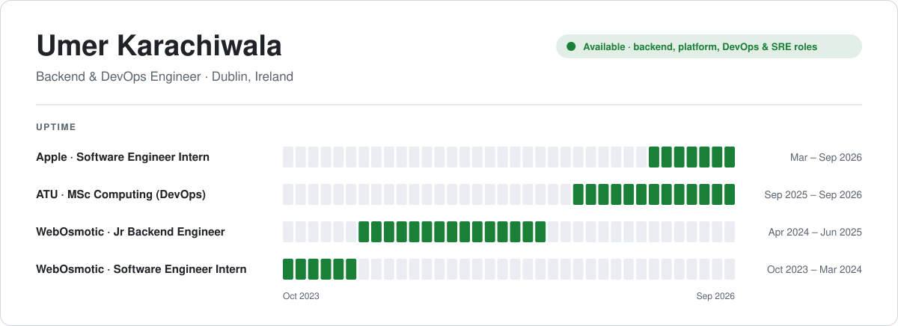
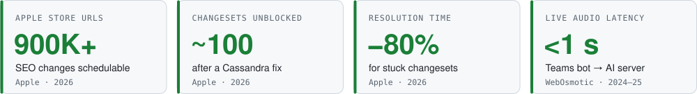
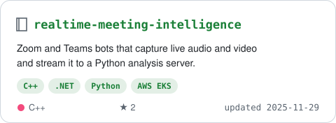
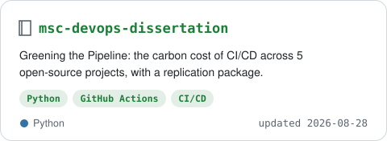
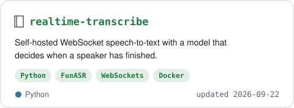
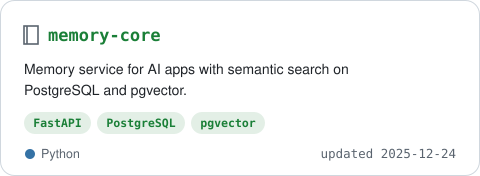
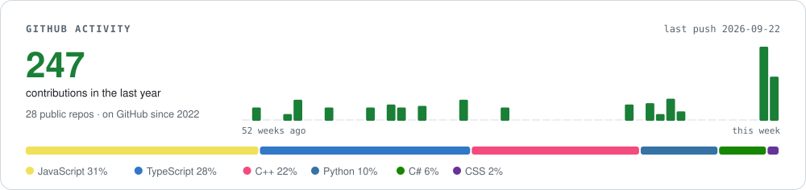

<a href="https://www.umer-karachiwala.com/"><picture><source media="(prefers-color-scheme: dark)" srcset="assets/header-dark.svg"><source media="(prefers-color-scheme: light)" srcset="assets/header-light.svg"></picture></a>

I build distributed services, event-driven pipelines and real-time AI systems, and the cloud infrastructure under them. 
2+ years in production at <b>Apple</b> and early-stage startups. MSc Computing (DevOps), ATU.

<picture><source media="(prefers-color-scheme: dark)" srcset="assets/impact-dark.svg"><source media="(prefers-color-scheme: light)" srcset="assets/impact-light.svg"></picture>

## Changelog

### `v2026.09` Apple · Software Engineer Intern
Mar – Sep 2026 · Java · Spring Boot · Cassandra · OpenSearch · SNS/SQS

- **Added** Scheduled Updates and Revert Changeset across 5 SEO services: changes planned up to 3 months ahead for **900K+ Apple Store URLs**
- **Added** changeset search on OpenSearch, replicated with SNS/SQS across a multi-DC deployment, after evaluating it against Apple's managed Solr
- **Fixed** a Cassandra issue that left **~100 changesets** stuck, cutting resolution time by **~80%**; added checks that stop conflicting edits corrupting live data
- **Led** a cross-functional team at Apple's GenAI Hackathon, shortlisted for sponsorship

<table>
<tr>
<td width="50%" valign="top">

### `v2025.06` WebOsmotic · Jr Backend Engineer
Apr 2024 – Jun 2025 · C# · .NET · Azure · Python

- **Added** a Microsoft Teams bot on Azure (multi-tenant) that joins scheduled interviews on its own
- **Added** a **sub-second** WebSocket pipeline streaming live audio to a Python AI server, with reconnects
- **Added** RAG questionnaire automation for narad.io, a third-party risk platform

</td>
<td width="50%" valign="top">

### `v2024.03` WebOsmotic · Software Engineer Intern
Oct 2023 – Mar 2024 · Node.js · MongoDB

- **Added** the core backend of an internal intranet: projects, documents, employee admin
- **Added** a live biometric punch-machine feed and a timezone-aware shift API
- **Fixed** multi-timezone data bugs at the source by storing every timestamp in UTC

</td>
</tr>
</table>

## Featured systems

<table>
<tr>
<td width="50%"><a href="https://github.com/Umer-2612/realtime-meeting-intelligence"><picture><source media="(prefers-color-scheme: dark)" srcset="assets/repo-realtime-meeting-intelligence-dark.svg"><source media="(prefers-color-scheme: light)" srcset="assets/repo-realtime-meeting-intelligence-light.svg"></picture></a></td>
<td width="50%"><a href="https://github.com/Umer-2612/msc-devops-dissertation"><picture><source media="(prefers-color-scheme: dark)" srcset="assets/repo-msc-devops-dissertation-dark.svg"><source media="(prefers-color-scheme: light)" srcset="assets/repo-msc-devops-dissertation-light.svg"></picture></a></td>
</tr>
<tr>
<td width="50%"><a href="https://github.com/Umer-2612/realtime-transcribe"><picture><source media="(prefers-color-scheme: dark)" srcset="assets/repo-realtime-transcribe-dark.svg"><source media="(prefers-color-scheme: light)" srcset="assets/repo-realtime-transcribe-light.svg"></picture></a></td>
<td width="50%"><a href="https://github.com/Umer-2612/memory-core"><picture><source media="(prefers-color-scheme: dark)" srcset="assets/repo-memory-core-dark.svg"><source media="(prefers-color-scheme: light)" srcset="assets/repo-memory-core-light.svg"></picture></a></td>
</tr>
</table>

## Stack

<table>
<tr>
<td align="center" width="25%"><b>Backend</b>  </td>
<td align="center" width="25%"><b>Cloud</b>  </td>
<td align="center" width="25%"><b>Data</b>  </td>
<td align="center" width="25%"><b>Delivery</b>  </td>
</tr>
</table>

## Activity

<picture><source media="(prefers-color-scheme: dark)" srcset="assets/activity-dark.svg"><source media="(prefers-color-scheme: light)" srcset="assets/activity-light.svg"></picture>

Employee of the Month, WebOsmotic · FusionHack 2024 finalist · B.Tech Computer Engineering, 2021 – 2025 · Mentored 20+ students for coding interviews
