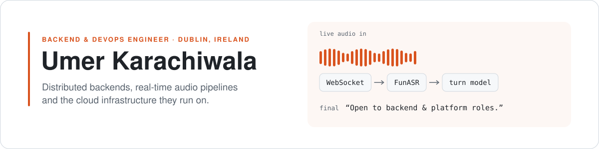

<picture>
  <source media="(prefers-color-scheme: dark)" srcset="assets/header-dark.svg">
  <source media="(prefers-color-scheme: light)" srcset="assets/header-light.svg">
  
</picture>

I build and run backend systems: distributed services, event-driven pipelines and the cloud infrastructure under them. Most recently a Software Engineer Intern at **Apple**.

[Portfolio](https://www.umer-karachiwala.com/) · [LinkedIn](https://www.linkedin.com/in/umer-karachiwala/) · [Email](mailto:karachiwalaumer2612@gmail.com)

## Changelog

### `v2026.09` · Apple · Software Engineer Intern
Mar – Sep 2026 · Java, Spring Boot, Cassandra, OpenSearch, SNS/SQS

- **Added** Scheduled Updates and Revert Changeset across 5 SEO services, so business teams can schedule metadata changes up to 3 months ahead for **900K+ Apple Store URLs**
- **Added** changeset content search on OpenSearch, replicated with SNS/SQS across a multi-DC deployment, so teams search before/after values across hundreds of thousands of records
- **Fixed** a Cassandra issue that left **~100 changesets** stuck, cutting resolution time by **~80%**
- **Added** checks that stop conflicting SEO edits from corrupting live data
- **Evaluated** OpenSearch against Apple's managed Solr, then provisioned it across environments with Apple's DB team
- **Led** a cross-functional team at Apple's internal GenAI Hackathon, shortlisted for sponsorship

### `v2025.06` · WebOsmotic · Jr Backend Engineer
Apr 2024 – Jun 2025 · C#, .NET, Microsoft Graph, Azure, Python

- **Added** a Microsoft Teams bot, run as an Azure multi-tenant service, that joins scheduled interviews on its own; owned uptime and session reliability across tenants
- **Added** a sub-second WebSocket pipeline streaming live audio from the bot to a Python AI server, with stream health checks and reconnect handling
- **Added** document ingestion and RAG questionnaire automation for narad.io, an AI-powered third-party risk platform, with retries for consistent answers

### `v2024.03` · WebOsmotic · Software Engineer Intern
Oct 2023 – Mar 2024 · Node.js, MongoDB

- **Added** the core backend of an internal intranet: projects, documents and employee admin
- **Added** a live biometric punch-machine integration and a timezone-aware shift API
- **Fixed** multi-timezone data bugs at the source by storing every timestamp in UTC

## Deployments

| Project | What it does | Last deploy |
|---|---|---|
| [realtime-meeting-intelligence](https://github.com/Umer-2612/realtime-meeting-intelligence) | Zoom (C++) and Teams (.NET) bots streaming live audio and video to a Python server on AWS EKS |  |
| [msc-devops-dissertation](https://github.com/Umer-2612/msc-devops-dissertation) | *Greening the Pipeline*: carbon cost of CI/CD across 5 open-source projects, with a replication package |  |
| [realtime-transcribe](https://github.com/Umer-2612/realtime-transcribe) | Self-hosted WebSocket speech-to-text with model-based turn detection |  |
| [memory-core](https://github.com/Umer-2612/memory-core) | FastAPI memory service with semantic search on PostgreSQL + pgvector |  |
| [FedSC-Risk](https://github.com/Umer-2612/FedSC-Risk) | Federated learning with differential privacy for supply chain risk |  |

## Stack

| Area | Tools |
|---|---|
| Languages | Java, TypeScript, Python, C#, C++ |
| Backend | Spring Boot, Node.js / Express, FastAPI, .NET |
| Data and search | Cassandra, PostgreSQL, MongoDB, Redis, OpenSearch, Solr |
| Cloud and delivery | AWS (EKS, EC2, SQS/SNS, CloudFormation), Azure (AKS, Bot Service), Docker, Kubernetes, Terraform, GitHub Actions, Jenkins |
| Observability | Splunk, Prometheus, CloudWatch, ELK |
| AI | RAG, pgvector, speech-to-text, Claude and OpenAI APIs |

## Background

MSc Computing (DevOps), Atlantic Technological University, 2025 – 2026 · B.Tech Computer Engineering, Bhagwan Mahavir College, 2021 – 2025 (CGPA 8.48/10)

Employee of the Month at WebOsmotic · FusionHack 2024 finalist · Mentored 20+ students for coding interviews

---

Hiring for backend, platform or DevOps work? Page me at [karachiwalaumer2612@gmail.com](mailto:karachiwalaumer2612@gmail.com).
