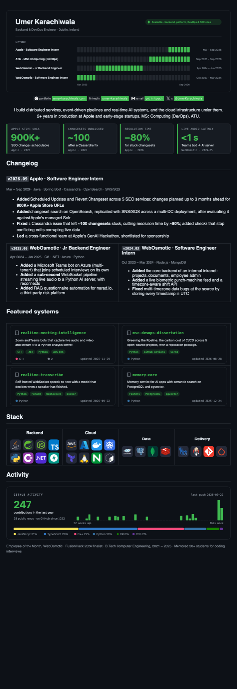
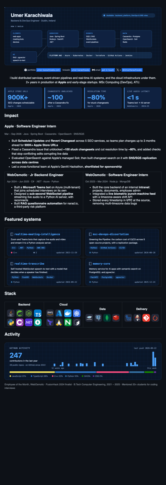
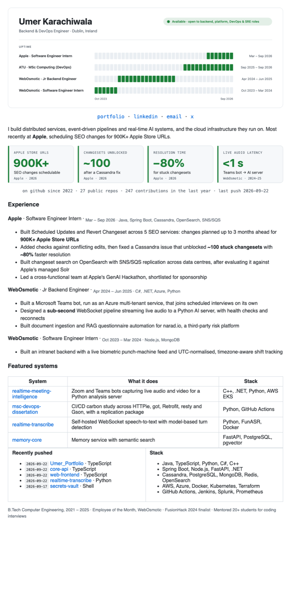
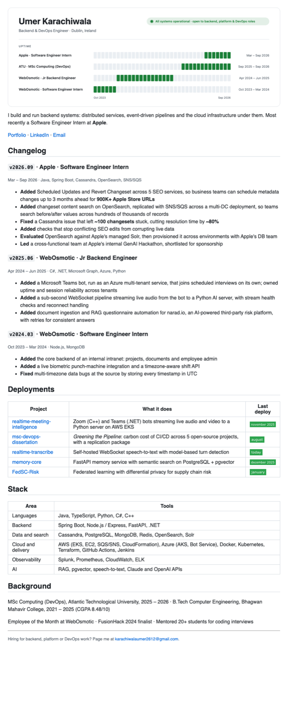
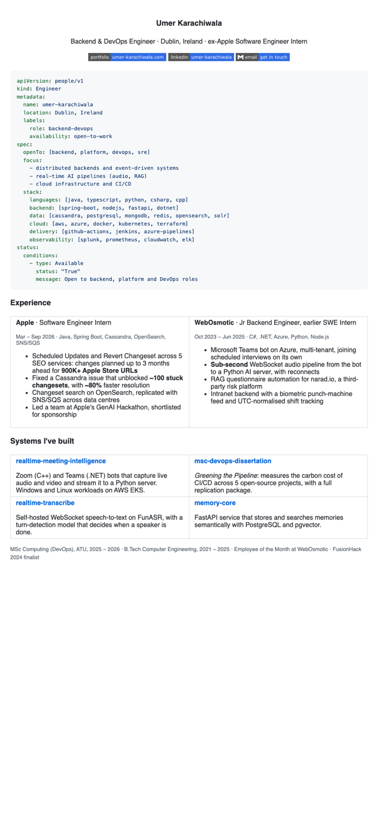
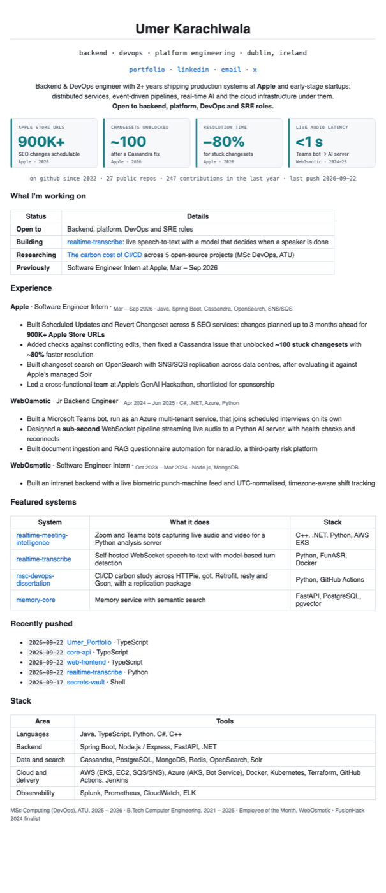

# GitHub profile options

Seven alternatives to the current profile at [github.com/Umer-2612](https://github.com/Umer-2612). Each link opens the real rendered README; the screenshots are the light theme.

| # | Option | Best for | Look |
|---|---|---|---|
| 6 | [Ops dashboard](https://github.com/Umer-2612/Umer_Portfolio/tree/docs/github-profile-option-b/github-profile-option-6) | Richest option: career timeline, impact panels, changelog, custom repo cards, live activity card | Green observability console |
| 7 | [Blueprint](https://github.com/Umer-2612/Umer_Portfolio/tree/docs/github-profile-option-b/github-profile-option-7) | Same card system with an animated architecture diagram of how you build | Blue blueprint |
| 1 | [Status page](https://github.com/Umer-2612/Umer_Portfolio/tree/docs/github-profile-option-b/github-profile-option-b) | The most visual: career as an uptime timeline, experience as a changelog | Techy, DevOps themed |
| 2 | [Kubernetes manifest](https://github.com/Umer-2612/Umer_Portfolio/tree/docs/github-profile-option-b/github-profile-option-2) | Standing out to DevOps and platform teams | Minimal, code first |
| 3 | [Evidence first](https://github.com/Umer-2612/Umer_Portfolio/tree/docs/github-profile-option-b/github-profile-option-3) | Fastest recruiter scan: status table, impact panels, live activity | Clean, dashboard style |
| 4 | [Minimal senior](https://github.com/Umer-2612/Umer_Portfolio/tree/docs/github-profile-option-b/github-profile-option-4) | Reads like senior infra engineers' profiles; no images | Plain text, about 25 lines |
| 5 | [Best shot](https://github.com/Umer-2612/Umer_Portfolio/tree/docs/github-profile-option-b/github-profile-option-5) | Option 3's clarity with the status-page timeline as the header | Techy and clear |

## 6. Ops dashboard (recommended)

## 7. Blueprint

## 5. Best shot

## 1. Status page

## 2. Kubernetes manifest

## 3. Evidence first

## 4. Minimal senior

